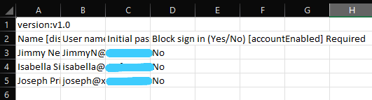
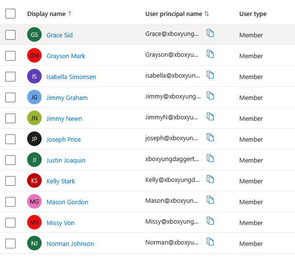
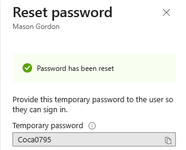
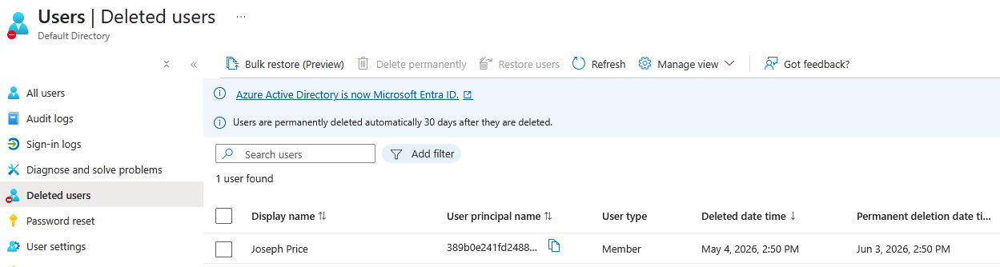

# Entra ID Azure Lab

Azure-based Microsoft Entra ID lab covering cloud user and group management, bulk user creation, directory role assignment, multi-factor authentication, password reset, session management, and user lifecycle management.

---

## Table of Contents

1. [Entra ID Overview](#entra-id-overview)
2. [Creating Users](#creating-users)
3. [Bulk User Creation](#bulk-user-creation)
4. [Creating Groups and Adding Members](#creating-groups-and-adding-members)
5. [Assigning Directory Roles](#assigning-directory-roles)
6. [Multi-Factor Authentication](#multi-factor-authentication)
7. [Password Reset](#password-reset)
8. [Revoke User Sessions](#revoke-user-sessions)
9. [Delete and Restore a User](#delete-and-restore-a-user)

---

## Software Used

- Microsoft Azure
- Microsoft Entra ID

---

## Environments Used

- Microsoft Azure
- Windows Server 2022

---

## Entra ID Overview

Microsoft Entra ID is Microsoft's cloud-based identity and access management service used to manage users, groups, and access to resources.

- The architecture below illustrates how the Azure Virtual Machine, Microsoft Entra ID, Microsoft 365 Admin Center, and Active Directory Domain Services interact within this lab environment.

---

## Creating Users

Cloud-only users were created directly in the Entra ID portal without the need for an on-premises Domain Controller.

- Cloud-only test users were created in Microsoft Entra ID to simulate managing identities in a modern cloud environment.

---

## Bulk User Creation

Multiple users can be created at once in Entra ID using a CSV file upload, which is useful for onboarding large numbers of employees efficiently.

- Multiple users were created simultaneously using the bulk create feature in Microsoft Entra ID by uploading a formatted CSV file.

---

## Creating Groups and Adding Members

Security groups control access to resources and assign permissions. Microsoft 365 groups provide shared access to tools like Teams, SharePoint, and Outlook.

- A Security group and a Microsoft 365 group were created in Entra ID to demonstrate the difference between group types used for access control and collaboration.

- Test users were added to the Cloud-IT-Staff security group to practice group membership management in Microsoft Entra ID.

---

## Assigning Directory Roles

Directory roles define what administrative actions a user can perform within the tenant without giving them full Global Administrator access.

- The Helpdesk Administrator directory role was assigned to a test user in Entra ID, simulating how IT administrators grant elevated permissions to help desk staff.

---

## Multi-Factor Authentication

MFA adds a second layer of verification beyond a password, reducing the risk of unauthorized account access.

- Multi-Factor Authentication was enabled for test users in Microsoft Entra ID to simulate enforcing MFA across an organization.

---

## Password Reset

Administrators can reset a user's password directly from the Entra ID portal, generating a temporary password that the user must change on next login.

- A password reset was performed on a test user account from the Entra ID admin portal, simulating a common help desk request.

---

## Revoke User Sessions

Revoking a user's sessions immediately signs them out of all devices and applications. This is used when an account is compromised or an employee is terminated.

- A user's active sessions were revoked in Microsoft Entra ID to simulate an account security response.

---

## Delete and Restore a User

Deleted users in Entra ID are kept in a recycle bin for 30 days before being permanently removed. This allows administrators to restore accounts that were accidentally deleted.

- A test user account was deleted and then successfully restored from the Deleted users section in Microsoft Entra ID.

---

## Challenges and Takeaways

**Challenges:**

**Takeaways:**
