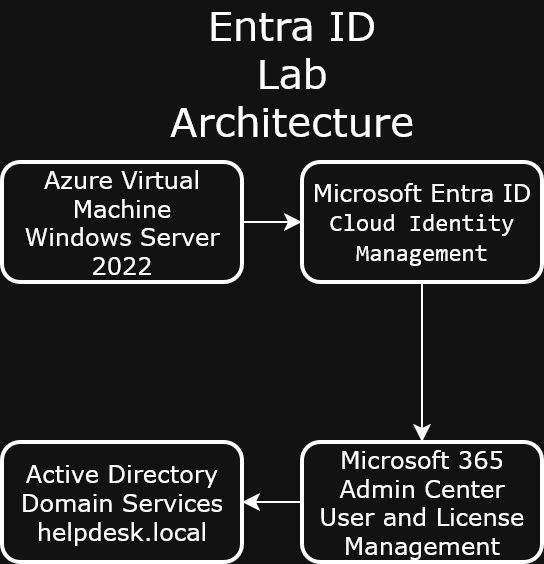
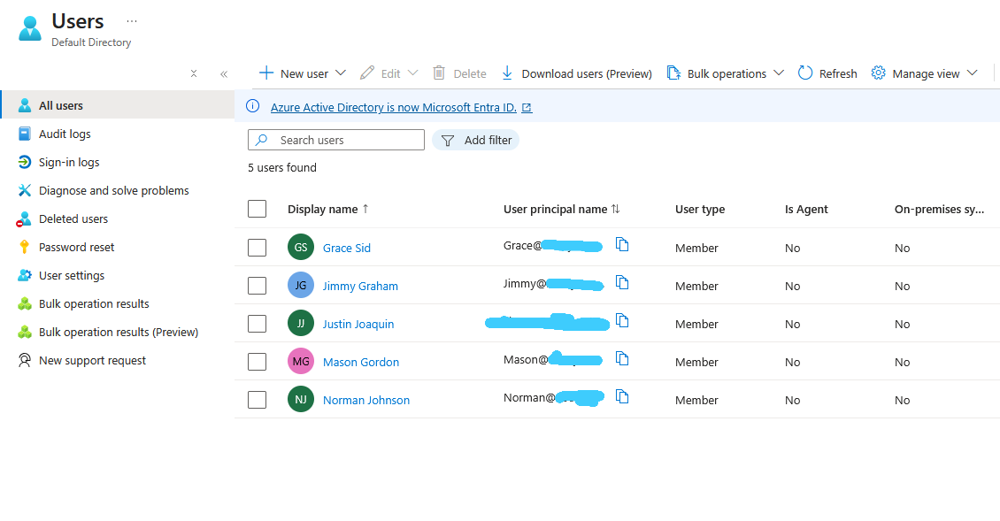
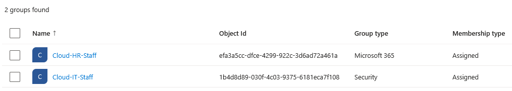
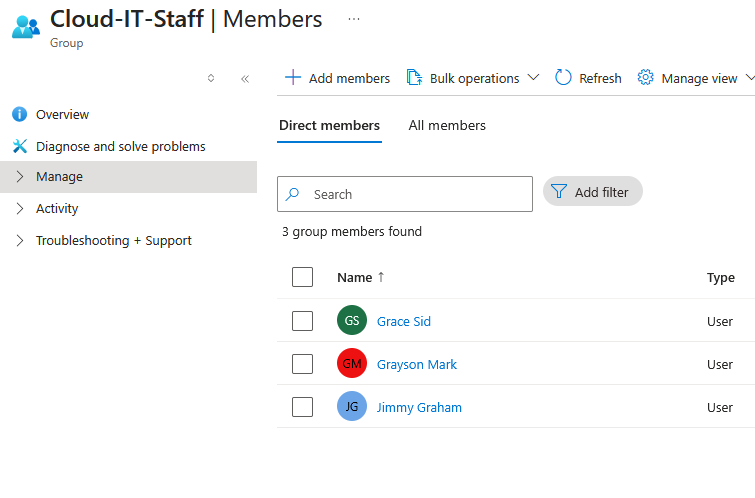
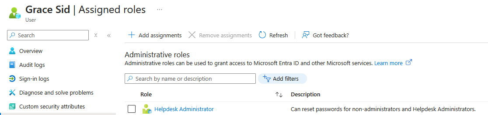
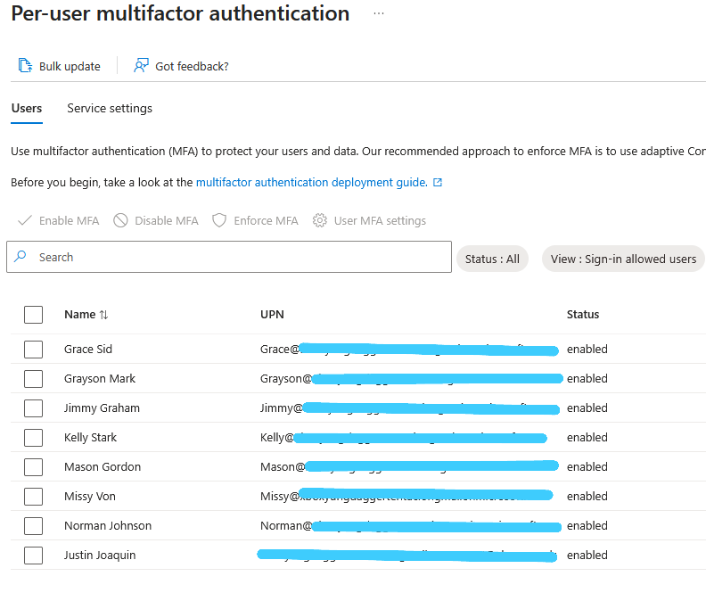

# Entra ID Azure Lab

Azure-based Microsoft Entra ID lab covering cloud user and group management, directory role assignment, conditional access policies, multi-factor authentication, self-service password reset, and Microsoft 365 Admin Center administration.

---

## Table of Contents

1. [Entra ID Overview](#entra-id-overview)
2. [Creating Users](#creating-users)
3. [Creating Groups and Adding Members](#creating-groups-and-adding-members)
4. [Assigning Directory Roles](#assigning-directory-roles)
5. [Multi-Factor Authentication](#multi-factor-authentication)
6. [Self-Service Password Reset](#self-service-password-reset)
7. [Conditional Access Policies](#conditional-access-policies)
8. [Microsoft 365 Admin Center](#microsoft-365-admin-center)

---

## Software Used

- Microsoft Azure
- Microsoft Entra ID
- Microsoft 365 Admin Center
- PowerShell

---

## Environments Used

- Microsoft Azure
- Windows Server 2022

---

## Entra ID Overview

Microsoft Entra ID is Microsoft's cloud-based identity and access management service used to manage users, groups, and access to resources.

- The architecture below illustrates how the Azure Virtual Machine, Microsoft Entra ID, Microsoft 365 Admin Center, and Active Directory Domain Services interact within this lab environment.

---

## Creating Users

Cloud-only users were created directly in the Entra ID portal without the need for an on-premises Domain Controller.

- Cloud-only test users were created in Microsoft Entra ID to simulate managing identities in a modern cloud environment.

---

## Creating Groups and Adding Members

Security groups control access to resources and assign permissions. Microsoft 365 groups provide shared access to tools like Teams, SharePoint, and Outlook.

- A Security group and a Microsoft 365 group were created in Entra ID to demonstrate the difference between group types used for access control and collaboration.

- Test users were added to the Cloud-IT-Staff security group to practice group membership management in Microsoft Entra ID.

---

## Assigning Directory Roles

Directory roles define what administrative actions a user can perform within the tenant without giving them full Global Administrator access.

- The Helpdesk Administrator directory role was assigned to a test user in Entra ID, simulating how IT administrators grant elevated permissions to help desk staff.

---

## Multi-Factor Authentication

MFA adds a second layer of verification beyond a password, reducing the risk of unauthorized account access.

- Multi-Factor Authentication was enabled for test users in Microsoft Entra ID to simulate enforcing MFA across an organization.

---

## Self-Service Password Reset

SSPR allows users to reset their own passwords without contacting the help desk, reducing ticket volume and improving productivity.

- Self-Service Password Reset was configured in Microsoft Entra ID to allow users to reset their own passwords using verified authentication methods.

---

## Conditional Access Policies

Conditional Access policies define rules that control how and when users can access cloud resources based on conditions like location, device, or user risk.

- A Conditional Access policy was created to enforce MFA for all users when signing into the Azure portal, simulating a common enterprise security requirement.

---

## Microsoft 365 Admin Center

The Microsoft 365 Admin Center is the central hub for managing users, licenses, groups, and settings across all Microsoft cloud services.

- The Microsoft 365 Admin Center was explored to demonstrate familiarity with the interface used by administrators to manage users, licenses, and settings across Microsoft cloud services.

---

## Challenges and Takeaways

**Challenges:**

**Takeaways:**
